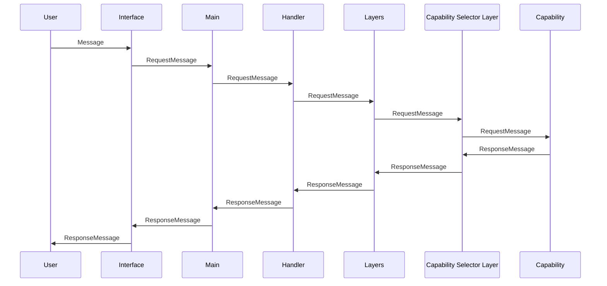
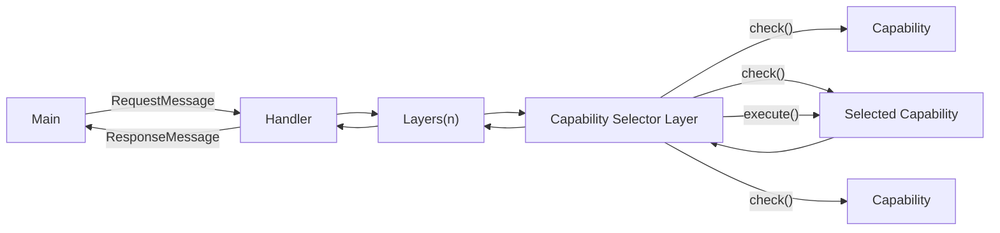

# Layer-Capability Pattern
A new design pattern for Extended Intelligence systems

The Layer-Capability Pattern is a new design pattern for building Extended Intelligence systems. It is designed to be a simple, flexible, and scalable pattern that can be used to build systems where a user sends input to the system and expects an output. 

The system is based in the idea of Structured Intelligence. Large language models while currently very capable are still limited and probabalistic. By structuring the data and capabilities of the system, we can build a system that is more intelligent than the sum of its parts.


## Overview

User messages come from an external interface or repl and are converted to a `RequestMessage` and passed to a handler. The handler then passes the message through a series of layers that can either reject the message entirely or modify it and pass it to the next layer. The final layer is a capability selector, which selects the capability that should handle the message. The capability is then executed and a `ResponseMessage` is passed back through the layers and back to the handler which then sends the response back to the interface it came from.






## Principals

**1. Request-Response Pattern (Universal message format):**
All interactions with services in the system are based on a request-response model. Every service must be able to accept a `RequestMessage` and return a `ResponseMessage`.

**2. Capability Registration and Discovery:**
Each service must be able to register itself with a central registry (like Askur), providing details about the capabilities it provides. The registry can then route `RequestMessage`s to the appropriate service based on its capabilities.

**3. Layered Pre and Post Processing:**
Before messages are passed to the capabilities, they are passed through a series of layers. Each layer can either reject the message entirely or modify it and pass it to the next layer. This allows for things like security, like rejecting unregistered users, adding memory to the system by storing Request and Response messages or even doing pre-processing like converting the message to an embedding.

Messages pass back through the layers in the opposite direction after being handled by the capability. This allows for other patterns like checking the response for undesirable content before sending it back to the user.

```rust
pub trait Layer {
    async fn execute(&mut self, message: &RequestMessage) -> RequestMessage;
}
```

**4. Capability Scoring:**
Capabilities are the parts of the application that respond to the user. They provide an interface that allows them to implement a check function that returns a score for how well they can handle a message and an execute function that returns a response message. This allows for multiple capabilities to be registered and for the best one to be selected for each message.

Allowing the capabilites to calculate their own score allows for simple capabilities
that, for example do an exact match on a command, to be registered alongside more complex capabilities that use machine learning to determine if they can handle a message.

```rust
pub trait Capability {
    async fn check(&mut self, message: &RequestMessage) -> f32;
    async fn execute(&mut self, message: &RequestMessage) -> ResponseMessage;
}
```

Each capability must be able to provide a score indicating how well it can handle a given `RequestMessage`. This allows the system to intelligently route requests to the most appropriate capability.

**5. Message Embedding:**
To enhance the system's intelligence, `RequestMessage`s may be converted into a text or data embedding. This allows for more sophisticated routing and handling of requests, such as using machine learning models.
