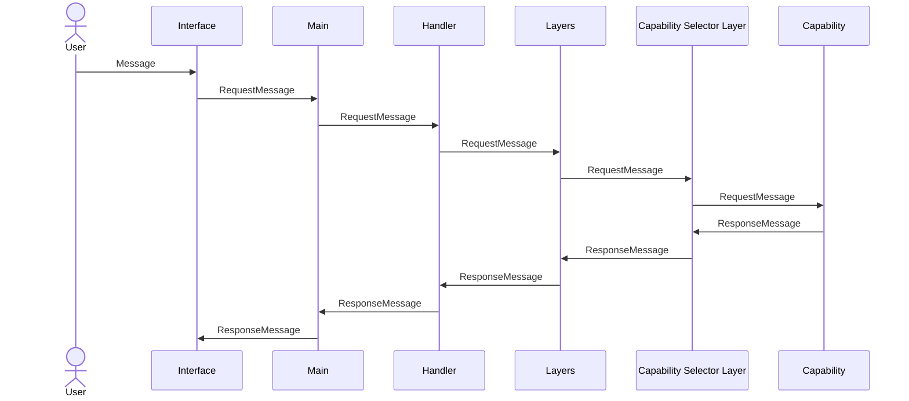
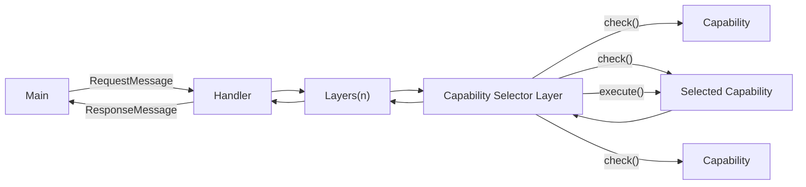

# Layer-Capability Pattern

## A New Design Pattern for Extended Intelligence Systems

The **Layer-Capability Pattern** is an architectural approach designed for building Extended Intelligence systems that prioritize simplicity, flexibility, and scalability. It is particularly effective for interactive systems, where user inputs require intelligent and contextually relevant responses.

## Introduction

While Large Language Models (LLMs) are powerful, their inherently probabilistic nature introduces significant limitations. The Layer-Capability Pattern addresses these limitations by structuring interactions within the system, enabling more reliable and intelligent outcomes than any individual component could achieve alone.

## Core Concepts

### Cortex Trait

At the core of the Layer-Capability Pattern is the `Cortex` trait, which defines a unified, asynchronous, message-based architecture for handling incoming requests:

```rust
#[async_trait]
pub trait Cortex {
    async fn tell(&self, req: RequestMessage) -> Result<(), anyhow::Error>;
}
```

This trait ensures that all components—whether layers or capabilities—handle incoming messages uniformly.

### Layer Trait

The `Layer` trait expands upon the `Cortex` trait, introducing a method specifically for processing outgoing response messages:

```rust
#[async_trait]
pub trait Layer: Cortex {
    async fn respond(&self, res: ResponseMessage) -> Result<ResponseMessage, anyhow::Error>;
}
```

This allows layers to independently manage response transformations, validations, or even rejections.

## Pattern Overview

The Layer-Capability Pattern workflow:

1. A user submits a message via an interface or REPL.
2. The message is transformed into a structured `RequestMessage`.
3. This request sequentially passes through multiple layers, each capable of modifying or rejecting it.
4. The final layer, known as the Capability Selector, evaluates registered capabilities to determine the best fit.
5. The chosen capability processes the request and returns a structured `ResponseMessage`.
6. The response travels back through the layers, undergoing optional processing via each layer’s `respond` method, before reaching the user.

### Interaction Diagrams

#### Sequence Diagram


#### Flowchart Diagram


## Core Principles

### 1. Request-Response Pattern

All interactions follow a consistent Request-Response format:

- Components receive a `RequestMessage` and return a `ResponseMessage`.

### 2. Capability Registration and Discovery

Capabilities self-register within a central registry, providing descriptive metadata and logic to aid in dynamic selection.

### 3. Layered Pre- and Post-Processing

Layers sequentially process requests and responses, potentially enabling:

- Security enforcement
- Contextual enrichment
- Message transformation
- Response validation and filtering

### 4. Capability Scoring

Capabilities dynamically assess their suitability for handling requests via scoring:

- Simple capabilities may rely on exact-match scoring.
- Complex capabilities may utilize ML-driven scoring.

```rust
#[async_trait]
pub trait Capability: Cortex {
    async fn check(&self, message: &RequestMessage) -> Result<f32, anyhow::Error>;
    async fn tell(&self, message: RequestMessage) -> Result<(), anyhow::Error>;
}
```

## Advanced Features

The Layer-Capability Pattern includes advanced functionalities to enhance robustness and flexibility:

### Two-Stage Capability Selection

Capability selection operates in two stages:

1. **Score-based Selection:**
   - Capabilities provide suitability scores (1.0: perfect, -1.0: unsuitable).
   - Capabilities with high scores (>0.5) are immediately selected.

2. **AI-based Selection (Fallback):**
   - In absence of a high-scoring match, an LLM selects capabilities based on their descriptions.

## Benefits of the Cortex-Based Architecture

This architecture facilitates:

- **Bidirectional Communication:** Layers and capabilities communicate responses independently.
- **Asynchronous Operations:** Components process requests without sequential waiting.
- **Event-Driven Interactions:** Components react dynamically to events and internal logic.
- **Flexible Routing:** Adaptive and context-aware message routing.

These attributes enable sophisticated interaction patterns:

- Streaming responses
- Concurrent request processing
- Proactive notifications
- Multi-response interactions

## Conclusion

The Layer-Capability Pattern provides a robust and flexible framework for developing intelligent systems. By integrating structured logic with probabilistic language models, it significantly enhances interaction quality and system scalability.

