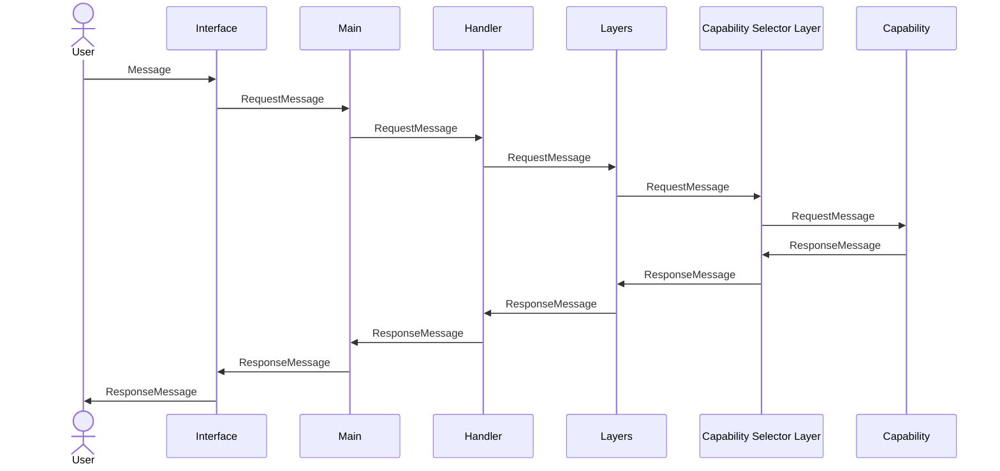
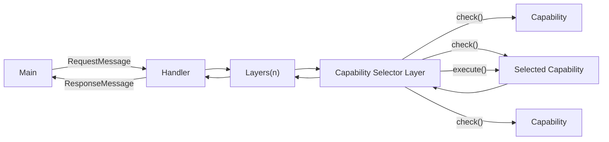

# Layer-Capability Pattern
A new design pattern for Extended Intelligence Systems

The Layer-Capability Pattern is a fresh approach to constructing Extended Intelligence systems, with a focus on simplicity, flexibility, and scalability. It's particularly suitable for systems where a user provides input and anticipates an output.

The concept is rooted in the idea of Structured Intelligence. While large language models are indeed capable, their performance is probabilistic and they have their limitations. By structuring the data and capabilities of the system, we can build a system that exhibits more intelligence than the sum of its components.

## Overview

User messages originate from an external interface or REPL, converted into a RequestMessage, and are passed to a handler. The handler, in turn, sends the message through a series of layers. Each layer has the power to either reject the message entirely or alter it and forward it to the next layer. The final layer, a capability selector, chooses the capability to process the message. The selected capability is then executed, producing a ResponseMessage that is sent back through the layers, the handler, and eventually to the origin interface.






## Principles

**1. Request-Response Pattern (Universal Message Format):**
All interactions within the system abide by a request-response model. Every component, whether a layer or a capability must be able to accept a RequestMessage and return a ResponseMessage.

**2. Capability Registration and Discovery:**
Each capability must register itself with a central registry, providing details about its capabilities. This registry is then used by the capability selector layer to determine which capability is best suited to handle a given message.

**3. Layered Pre and Post Processing:**
Before RequestMessages reach the capabilities, they undergo a series of transformations through various layers. Each layer can either reject the message entirely or modify it and pass it to the next layer. This allows for things like security by rejecting unregistered users, adding memory to the system by storing Request and Response messages or even doing pre-processing like converting the message to an embedding.

Messages pass back through the layers in the opposite direction after being handled by the capability. This allows for other patterns like checking the response for undesirable content before sending it back to the user.

```rust
pub trait Layer {
    async fn execute(&mut self, message: &RequestMessage) -> RequestMessage;
}
```

**4. Capability Scoring:**
capabilities are the parts of the application that respond to the user. They provide an interface that allows them to implement a check function that returns a score for how well they can handle a message and an execute function that returns a response message. This allows for multiple capabilities to be registered and for the best one to be selected for each message.

Allowing the capabilities to calculate their own score allows for simple capabilities
that, for example do an exact match on a command, to be registered alongside more complex capabilities that use machine learning to determine if they can handle a message.

```rust
pub trait Capability {
    async fn check(&mut self, message: &RequestMessage) -> f32;
    async fn execute(&mut self, message: &RequestMessage) -> ResponseMessage;
}
```

Each capability must be able to provide a score indicating how well it can handle a given `RequestMessage`. This allows the system to intelligently route requests to the most appropriate capability.

