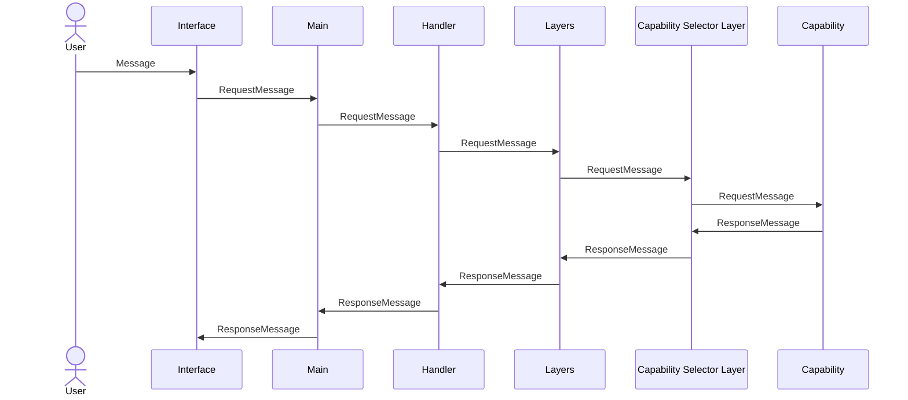
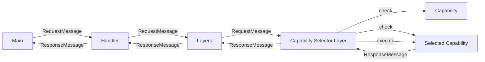

# Layer-Capability Pattern

**A new design pattern for Extended Intelligence Systems**

The Layer-Capability Pattern is an architectural approach designed for constructing Extended Intelligence systems, prioritizing simplicity, flexibility, and scalability. It is particularly effective for interactive systems, where user inputs require intelligent responses.

## Introduction

While Large Language Models (LLMs) are powerful, their probabilistic nature introduces limitations. The Layer-Capability Pattern addresses these limitations by structuring interactions within the system, enabling more intelligent and reliable outcomes than any component alone could achieve.

## Overview

The Layer-Capability Pattern organizes interactions as follows:

1. A user submits a message via an interface or REPL.
2. This message is converted into a structured `RequestMessage`.
3. The request passes sequentially through multiple layers, each capable of modifying or rejecting the request.
4. The final layer (Capability Selector) evaluates available capabilities to determine the best fit.
5. The selected capability processes the request, returning a structured `ResponseMessage`.
6. The response traverses back through layers, potentially undergoing post-processing before returning to the user.

### Interaction Diagrams





## Core Principles

### 1. Request-Response Pattern

All interactions follow a universal Request-Response format:

- Components accept a `RequestMessage` and return a `ResponseMessage`.

### 2. Capability Registration and Discovery

Capabilities self-register with a central registry, providing descriptions and handling logic to aid selection.

### 3. Layered Pre and Post Processing

Layers sequentially process messages, enabling:

- Security enforcement (authentication, validation)
- Memory storage for context
- Pre-processing (e.g., converting messages to embeddings)
- Post-processing (e.g., filtering inappropriate responses)

```typescript
interface Layer extends Cortex {
    tell(message: RequestMessage): Promise<Result<void>>;
}
```

### 4. Capability Scoring

Capabilities dynamically determine their suitability for handling requests by scoring messages:

- Simple capabilities can perform exact-match scoring.
- Complex capabilities use ML-based scoring methods.

```typescript
interface Capability extends Cortex {
    check(message: RequestMessage): Promise<number>;
    tell(message: RequestMessage): Promise<Result<void>>;
}
```

## Advanced Features

The Layer-Capability Pattern supports advanced functionalities to enhance robustness and flexibility:

### 5. Language Model Integration

The pattern supports integration with multiple language model providers, optimizing model selection:

```typescript
enum LanguageModelType {
    GPT4 = "gpt-4",
    ChatGPT = "chatgpt-4o-latest",
    Llama32 = "llama3.2",
    DeepSeek = "deepseek-r1"
}
```

Selection considers:
- Server health
- Model capabilities and requirements
- Performance and fallback strategies

### 6. Consistent Error Handling with Results Pattern

A unified error-handling strategy simplifies complexity:

```typescript
type Result<T> = {
    ok: (value: T) => Result<T>;
    err: (error: Error) => Result<T>;
}
```

Benefits:
- Simplifies error propagation
- Reduces boilerplate code

### 7. Observability and Tracing

Comprehensive monitoring is built-in:
- Span-based tracing
- Performance timings
- Detailed metadata for debugging

Enables:
- Real-time monitoring
- Optimized performance
- Efficient troubleshooting

### 8. Two-Stage Capability Selection

The capability selection employs a two-stage process:

1. **Score-based Selection:**
   - Capabilities return scores (1.0: perfect, -1.0: unsuitable)
   - Immediate selection for high-scoring capabilities (>0.5)

2. **AI-based Selection (Fallback):**
   - LLM-driven selection based on capability descriptions if no high-scoring match is found

## Message-Based Architecture

The Layer-Capability Pattern employs a flexible, message-based architecture, defined by the core `Cortex` interface:

```typescript
interface Cortex {
    tell(req: RequestMessage): Promise<Result<void>>;
}
```

This architecture supports:
- **Bidirectional Communication:** Layers and capabilities independently communicate responses.
- **Asynchronous Operations:** Components can respond without waiting for sequential completion.
- **Event-Driven Interactions:** Dynamic responses based on internal logic.
- **Flexible Routing:** Adaptive message routing based on context.

This flexibility enables advanced interaction patterns such as:
- Streaming responses
- Parallel request handling
- Proactive notifications and multi-response interactions

## Conclusion

The Layer-Capability Pattern provides a robust foundation for developing intelligent, flexible, and scalable systems, effectively leveraging both structured logic and probabilistic language models to enhance user interactions.

